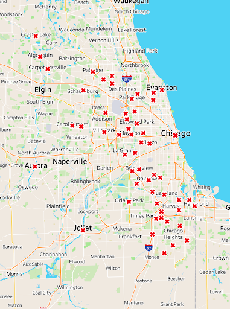

# Authors
Miles Cumiskey: https://github.com/mcumiskey

Joey Barilla: https://github.com/JoeyBarlia

Jackson: https://github.com/Jmanitou


# Overview
Here is our [Presentation](https://docs.google.com/presentation/d/1VDMkqF6xq5KMh7ojYRjgBoGUTAGVerL8MZRKFcDBNkE/edit?usp=sharing) and [Tableau](https://public.tableau.com/app/profile/miles.cumiskey/viz/Chicago_Car_Crashes/Map_Dash#1).

# Project Structure 
```
├── data
│   ├── Final_Data.csv
│   └── Final_Data.zip
├── images
│   ├── chicago_crash_map.png
├── .gitignore
├── README.md
├── Chicago_Crash_Data.pdf
└── Chicago_Car_Crash.ipynb
```
# Business Understanding
We are an advertisement company hired by the City of Chicago to create a series of safe driving Public Safety Anncouncements for young adults.

These ads will run on social media as well as being posted near high schools and college campuses.

In order to figure out what ads will be the most effective, we are examining the causes of fatal accidents for the age range: 15-22 year olds. Once we determine the most common causes of accidents, we will be able to tailor our ads for the city, and hopefully reduce fatalities for young drivers.

# Data Understanding and Analysis
Car crash and vehicle accident data was sourced from the Chicago Data Portal. It originates from the City of Chicago. The three dataframes we used were [Traffic Crashes-People](https://data.cityofchicago.org/Transportation/Traffic-Crashes-People/u6pd-qa9d/about_data),  [Traffic Crashes-Vehicles](https://data.cityofchicago.org/Transportation/Traffic-Crashes-Vehicles/68nd-jvt3/about_data), and [Traffic Crashes-Crashes](https://data.cityofchicago.org/Transportation/Traffic-Crashes-Crashes/85ca-t3if/about_data). We merged them together and took a sample of 350,000. We then filted for people living in Illinois, aged 15 to 22 and who were the one driving the vehicle at the time of the accident.

Data collection began in 2015, but was only adopted by all Chicago district police departments in 2017. The most recent data entry was from September 26, 2024.

To run the file, you will need to extract the Final_Data.zip into the data folder.
# Visualizations


Most of the fatal accidents were concentrated in low-income areas of Chicago. 


Instagram post advocating for drivers to slow down and save lives.


Large Poster reccomending drving solo. 

# Conclusion

## Education Campaign Focus Topics
Promote safer driving in young adults by: 

- Focusing our educational campaign on late night driving skills

- Educate young adults on the extra risk of driving on weekends and risk of carpooling

- Encourage young adults to obey Chicago speed limits

- Promote Vision 0 initiatives in schools. 

# Next Steps 

## Expand on Crash Location and Demographics

Examine the data in conjunction with Economic Hardship Data and Census information.

Vision 0 has already found correlation between accidents and historically poor areas: how can we improve driver education for these areas? 

Can we connect with the community to drive change?

## Expand our analysis to focus on Dangerous Roads and Speed Corridors

Teach young adults about what roads are the most dangerous and how to best navigate them. 
